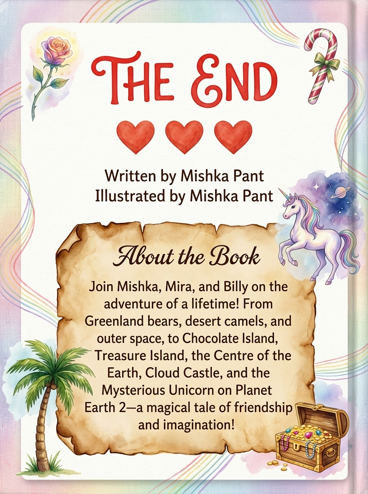

# The Giant Adventure 📖 *(Publisher Edition)*

> A publisher-ready children's picture book written and illustrated by 8-year-old **Mishka Pant**.

<p align="center">
  
  
</p>

---

## 🌟 About the Book

What starts as a holiday flight to Singapore turns into the adventure of a lifetime! Join eight-year-old Mishka and her best friends, Mira and Billy, as they journey across magical islands and beyond. From outsmarting bears on Greenland Island and riding camels past volcanoes, to tumbling through a space portal, visiting a candy house, sneaking past dragons at the Centre of the Earth, and befriending a lonely multi-colored unicorn on Planet Earth 2—this imaginative tale celebrates friendship, curiosity, and the boundless magic of childhood.

* **Author & Illustrator**: Mishka Pant (Age 8)
* **Main Characters**: Mishka, Mira, Billy

---

## 📚 Publisher Edition Deliverables

1. **[Printable & Publisher PDF (`the_giant_adventure.pdf`)](./the_giant_adventure.pdf)**
   * Full picture-storybook layout with high-resolution watercolor & colored-pencil illustrations (`illustrations/`), polished story typography, Front Cover, and Back Cover with the "About the Book" blurb.

2. **[EPUB3 Ebook (`the_giant_adventure.epub`)](./the_giant_adventure.epub)**
   * Reflowable EPUB3 format compatible with Apple Books, Kindle, Google Play Books, and e-readers.

3. **[Interactive Web Showcase (`index.html`)](https://kratos5589.github.io/mishka-ebook/)**
   * Features all 15 high-resolution publisher illustrations, Read-Aloud voice narration, and a **"🖼️ Compare Original Drawings"** toggle to view Mishka's original handmade pages alongside the publisher artwork.

4. **[Polished Manuscript (`story.md`)](./story.md)**
   * Complete lightly edited story manuscript and back-cover blurb.

---

## 🛠️ How to Build & Run Tests

```bash
# Run all unit tests
./venv/bin/python -m unittest discover -s . -p "test_*.py"

# Rebuild EPUB, PDF, and Web Ebook
./venv/bin/python build_epub.py
./venv/bin/python build_pdf.py
./venv/bin/python build_web.py
```

---

## 📜 License
Story & Artwork Concept © Mishka Pant.
